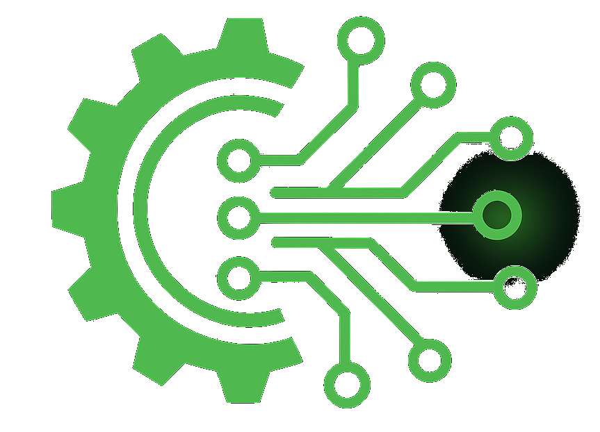

# <b><u>theaiengineer</u> - Capstone Project

## Overview
This repository contains four Capstone projects completed as part of the AI Engineer course https://theaiengineer.dev/ Together, they trace a deliberate progression from mathematical foundations, through neural network mechanics and modern large language models, to the deisgn of a fully structured, protocol-driven AI system embedded in a broader engineering context.

Each Capstone is self contained and documented in its own directory. The top-level purpose of this repository is to show hoe the individual projects fit together conceptually and technically.

The emphasis throughout is on <b>understanding, correctness</b> and <b>engineering discipline</b>: models are derived from first principles where possible, implementations are kepy explicit, and later systems are designed to be auditable, reproducible and extensible.

# Capstone 1 - Gradient-Based Optimisation Case Study
## Location: `aiecode/ch01/`
## Notebook: `tae_capstone_wk1.ipynb`

This first Capstone connects calculus-based analysis to first-order optimisation algorithms. Starting from an explicitly defined, non-smooth one-dimensional funcrtion, the project derives its piecewise structure, stationary points and global minima, then studies how gradient based methods behave when applied to it.

Gradient Descent, Heavy Ball momentum, Stochastic Gradient Descent and decaying learning-rate schedules are analysed side-by-side. The effects of step size, momentum, noise and decay are visualised through trajectories and convergence diagnostics, with particular attention paid to behavious near non-smooth points.

This capstone establishes a concrete intuition for optimisation dynamics that underpins all subsequent work with neural networks.

# Capstone 2 - Tiny One-Hidden_layer MLP (NumPy -> PyTorch)
## Location: `aiecode/ch02/`
## Notebook: `tae_capstone_wk2.ipynb`

The second Capstone develops the mathematical or computational foundations of neural networks using a minimal multilayer perceptron trained on the XOR problem.

The project begins with a fully manual NumPy implementation of forward and backward propogation, including an explicit application of the chain rule. It then transitions step-by-step into PyTorch: first reproducing the same computational graph without autograd, then enabling autograd and performing gradient checks, and finally expressing the model using `nn.Module` and `nn.Sequential`.

Diagnostics such as loss curves, gradient norms, ReLU activity and decision boundary visualisations are used throughout to validate correctness and build intuition. The Capstone ensures that later use of deep learning frameworks rest on a clear understanding of what they compute internally.

# Capstone 3 - Tiny Transformer Language Model
## Location: `aiecode/ch03/`
## Notebook: `tae_capstone_wk3.ipynb`

The third Capstone develops the core ideas behind modern transformer-based language model at a scale suitable for from-scratch implementation.

Beginning with sequence modelling and content-based attention, the project derives scaled dot-product attention and assembles a GPT-style decoder-only transformmer from fundamental components: multi-head self attention, feed-forward networks, residual connections, layer normalisation and positional encodings.

A small language model is trained on a tiny text corpus (Gordon Gekko's "Greed is Good" speech from the 1987 movie "Wall Street"), and its behaviour is analysed through training and validation loss, sampling strategies, and overfitting dynamics. The accompanying infrastructure emphasises reproducibility, using a containerised GPU environment while allowing local development via a remote interpreter.

This Capstone bridges the gap between neural-network mechanics and modern large language models.

# Capstone 4 - Incident Command Agent (Model Context Protocol)
## Location: `aiecode/ch04/Capstone`

The final Capstone shifts focus from model internals to system architecture. It implements an <b>Incident Command Agent</b> as a concrete demonstration of <b>Model Context Protocol</b>, showing how a Large Language Model (LLM) can be embedded safely and credibly within a larger engineering system.

The agent operates and explicit <b>Observe -> Plan -> Act -> Learn</b> loop. It observes structured resources (alerts, telemetry, runbooks, memory), selects the next action using either a <b>Large Language Model</b> or <b>deterministic rules</b>, executes that action through a strictly designed tool interface, and records compact memory deltas and telemetry for replay and audit.

The system is intentionally split into two independent processes:

    *   a client (agent) responsible for orchestrating and planning
    *   An MCP server (tool stack) that exposes resources and tools via JSON-RPC

For demonstration purposes, the Capstone can also be run in a <b>Google Colab environment</b>. In this mode, the agent and MCP server run together using the same <b>stdio-based JSON-RPC protocol</b>, allowing the full agent-server loop to be exercised without local installation.

In practice, the Colab stdio configuration is most suitable for the <b>deterministic rules planner</b>. This enables a complete, zero-cost demonstration of MCP concepts - tools, resources, memory, telemetry, replay amd human handoff - without eequiring external API keys or persistent secrets.

Running the agent in <b>LLM planning mode</b> rfom Colab is possible, but requires explicit configuration of API cerdentials and acceptance of Colabs limitations around secret management and long-running processes. For this reason, LLM-based planning is considered an <b>advanced or optional variant</b> in Colab rather than the canonical execution path.

A more advanced demonstration runs the MCP server inside Colab as a network service (WebSockets) and connects to it from a local agent via a public tunnel (e.g. Cloudflared or ngrok). This allows LLM planning to occur locally while tools and resources live remotely, but introduces additional operational complexity. For assessment and clarity <b>local stdio execution remains the recommended and canonical mode</b>.

# Conceptual Progression Across Capstones
The four Capstones are intentionally cumulative:

    *   Capstone 1 builds intuition for optimisation dynamics
    *   Capstone 2 formalises learning via gradients and backpropogation
    *   Capstone 3 scales these ideas into modern transformer architectures
    *   Capstone 4 embeds such models into a disciplined, protocol driven system
The final project depends critically on the earlier ones, both mathematically and conceptually. Together, they demonstrate how theory, implementation and system design fit together in practical AI engineering.

# How to Navigate This Repository
Each Capstone directory contains its own README or notebook with detailed explanations and instructions. This top-level README is intended as a conceptual map rather than a replacement for those documents.

For hands-on work, start in the individual Capstone directories and follow the instructions provided there.

# <b>Summary</b>
<b>This repository demonstrates an end-to-end journey through modern AI engineering: from calculus and optimisation, through neural networks and transformers to the deisgn of structured, auditable agent systems. The focus throughout is not on treating models as black boxes, but on building understanding and control around how they learn reason and act within real systems</b>.
